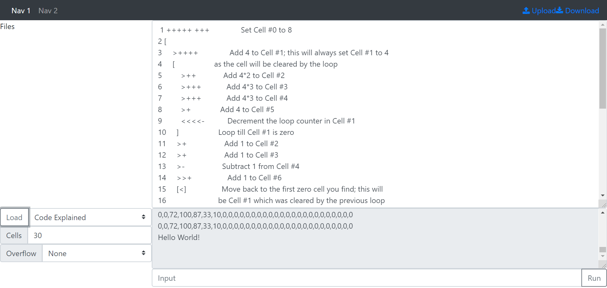

# bf-online
This is a brainfuck interpreter website. It uses the interpreter [here](https://github.com/miningape/bf-interpreter).

# Usage
You can select an example program or "blank" in the bottom left. The stack size is selected here too.

You can input code into the text box on the right, and then press run in the bottom right.
Input is a string that is read character by character after pressing run.

# ToDo:
- [x] Add Memory Size Selector
- [x] Add a few example programs
- [ ] Add file selector
- [ ] Add new file button
- [ ] Add Upload/Download Files
- [ ] Change the nav bar to include portfolio, as well as logo
- [ ] Make readme more full and include bf interpreter readme
- [ ] Change the run button to an icon
- [ ] Make memory options work
- [ ] Add Dark Mode
- [ ] Add More Example code as well as explaination
